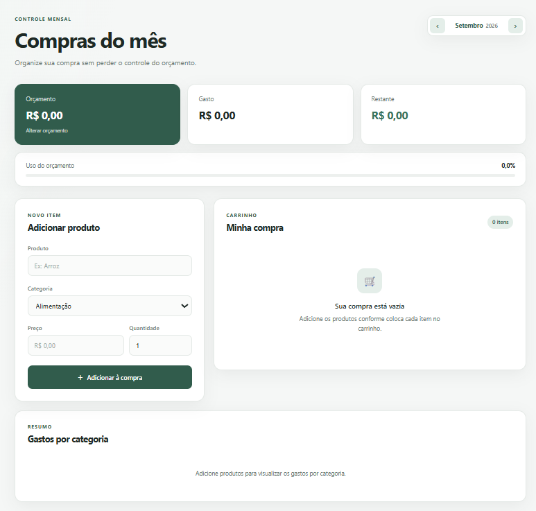

# 🛒 Compras do Mês

Aplicação web para planejamento e controle de compras mensais, desenvolvida com **Python, Flask e SQLite**.

O sistema permite organizar produtos por mês, definir um orçamento, acompanhar os gastos e manter um histórico das compras anteriores.

A proposta do projeto é reunir **lista de compras e controle financeiro** em uma interface simples, responsiva e fácil de utilizar.

---

## 📸 Preview



---

## ✨ Funcionalidades

### 🛒 Lista de compras

- Adicionar produtos
- Editar produtos cadastrados
- Excluir produtos
- Informar preço e quantidade
- Organizar produtos por categoria
- Marcar produtos como comprados
- Pesquisar produtos por nome ou categoria
- Filtrar entre todos, pendentes e comprados

### 💰 Controle de orçamento

- Definição de orçamento mensal
- Cálculo automático do valor gasto
- Cálculo do valor restante
- Indicador percentual de uso do orçamento
- Alerta visual quando o orçamento é ultrapassado
- Orçamento independente para cada mês

### 📊 Análise de gastos

- Resumo de gastos por categoria
- Percentual gasto em cada categoria
- Identificação da categoria com maior gasto
- Histórico mensal
- Média de gastos
- Comparação com o mês anterior
- Visualização da evolução dos gastos

### 📅 Organização mensal

Cada produto pertence a um determinado **mês e ano**.

Ao navegar para outro mês, uma nova lista pode ser criada sem apagar as compras anteriores.

Isso permite consultar novamente períodos passados e construir um histórico de gastos ao longo do tempo.

---

## 🖥️ Interface

A interface foi desenvolvida com foco em simplicidade e legibilidade.

O layout utiliza:

- design minimalista;
- paleta em tons de verde;
- componentes em cards;
- indicadores visuais de orçamento;
- barras de progresso;
- layout responsivo para diferentes tamanhos de tela.

---

## 🛠️ Tecnologias

| Tecnologia | Utilização |
| --- | --- |
| Python | Lógica da aplicação |
| Flask | Backend e rotas HTTP |
| SQLite | Persistência dos dados |
| Jinja2 | Renderização dinâmica das páginas |
| HTML5 | Estrutura da interface |
| CSS3 | Estilização e responsividade |
| JavaScript | Interações da interface |

---

## 🧠 Decisões técnicas

### Valores monetários em centavos

Os valores financeiros são armazenados no SQLite como **números inteiros representando centavos**.

Por exemplo:

```text
R$ 27,90 → 2790
```

Essa abordagem evita problemas de precisão que podem acontecer ao utilizar números de ponto flutuante para cálculos financeiros.

No backend, valores informados pelo usuário também são tratados utilizando `Decimal` antes da conversão para centavos.

### Histórico sem duplicação de dados

O histórico não utiliza uma tabela separada.

Cada produto possui informações de **mês e ano**, permitindo que os totais históricos sejam calculados diretamente a partir dos registros existentes.

### Separação por responsabilidade

A aplicação utiliza:

```text
Flask/Python → regras e cálculos
SQLite       → armazenamento
Jinja2/HTML  → apresentação dos dados
CSS          → aparência
JavaScript   → interações da interface
```

Os cálculos financeiros principais permanecem no backend.

---

## 📁 Estrutura

```text
compras-mes/
│
├── database/
│
├── static/
│   ├── css/
│   │   └── style.css
│   │
│   └── js/
│       └── app.js
│
├── templates/
│   └── index.html
│
├── .gitignore
├── app.py
├── README.md
└── requirements.txt
```

O arquivo do banco de dados não é enviado para o repositório e é criado localmente pela aplicação.

---

## 🚀 Como executar

### 1. Clone o repositório

```bash
https://github.com/julyaneric8/compras-mes.git
```

Entre na pasta:

```bash
cd compras-mes
```

### 2. Crie um ambiente virtual

```bash
python -m venv .venv
```

### 3. Ative o ambiente virtual

No Windows:

```bash
.venv\Scripts\activate
```

No Linux/macOS:

```bash
source .venv/bin/activate
```

### 4. Instale as dependências

```bash
pip install -r requirements.txt
```

### 5. Execute a aplicação

```bash
python app.py
```

### 6. Abra no navegador

```text
http://127.0.0.1:5000
```

O banco SQLite será criado automaticamente na primeira execução.

---

## 🗃️ Banco de dados

O projeto utiliza **SQLite**, portanto não é necessário instalar ou configurar um servidor de banco de dados separado.

Os principais dados armazenados são:

```text
Produto
├── nome
├── categoria
├── preço
├── quantidade
├── mês
├── ano
└── status de comprado
```

Também são armazenados os orçamentos definidos para cada mês.

---

## 📱 Responsividade

A interface foi preparada para funcionar em:

- computadores;
- tablets;
- smartphones.

Os componentes são reorganizados automaticamente de acordo com o espaço disponível na tela.

---

## 🎯 Objetivo do projeto

Este projeto foi desenvolvido como prática de **desenvolvimento web full stack**, trabalhando conceitos como:

- criação de aplicações com Flask;
- rotas HTTP;
- formulários;
- operações CRUD;
- persistência com SQLite;
- consultas e agregações SQL;
- manipulação de valores monetários;
- renderização com Jinja2;
- JavaScript no frontend;
- design responsivo;
- organização e evolução de um projeto web.

---

## 📄 Licença

Projeto desenvolvido para fins de estudo e portfólio.
